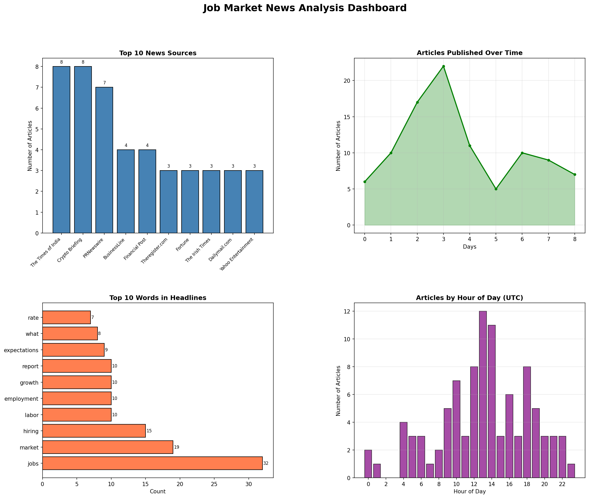
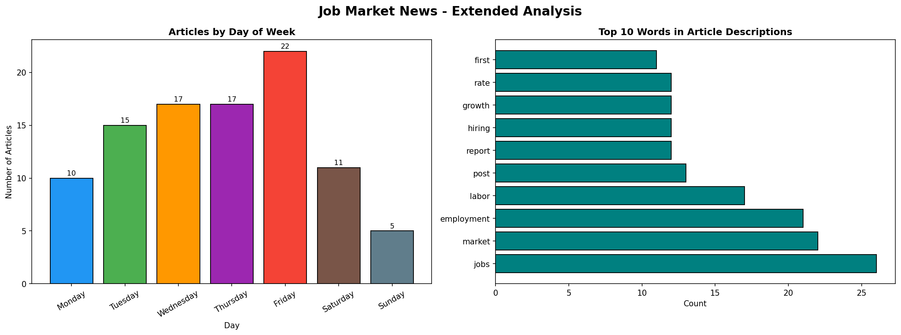
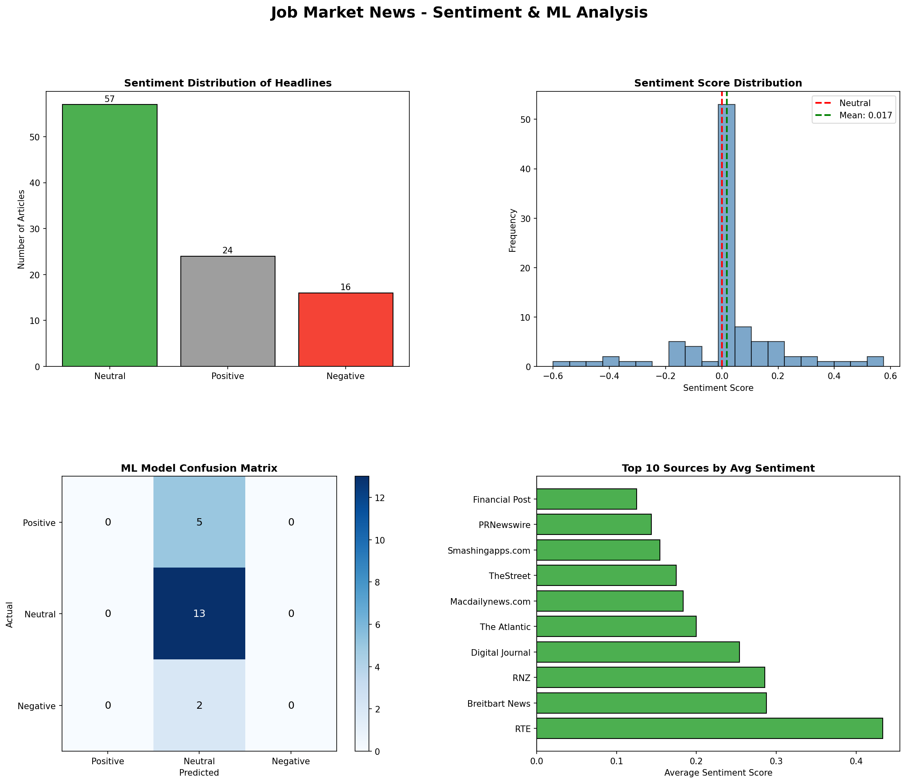
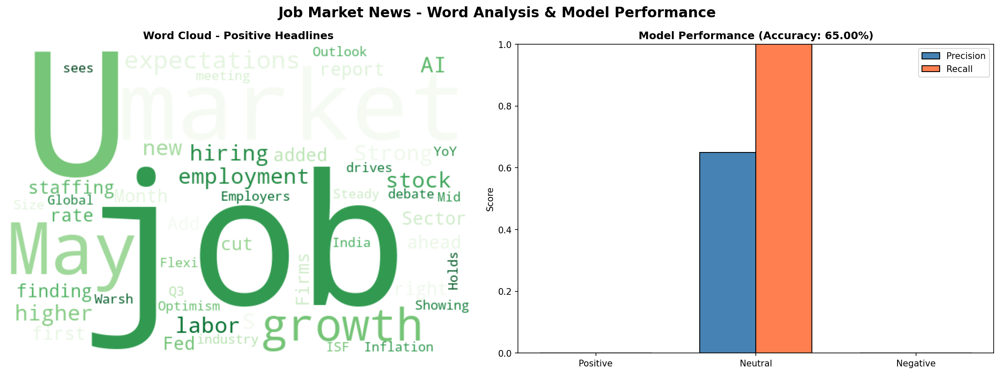

## Overview
This section presents a comprehensive analysis of job market news data collected via the NewsAPI. 
We performed exploratory data analysis, sentiment analysis, and built a machine learning model 
to classify article sentiment.

---

## Job Market News Dashboard

This dashboard shows the top news sources, publishing trends over time, most common words 
in headlines, and the distribution of articles by hour of day.

---

## Extended Analysis - Day & Description Trends

This chart breaks down articles by day of the week and identifies the most frequent words 
in article descriptions. Friday had the highest volume of job market news published.

---

## Sentiment & ML Model Dashboard

Using TextBlob, we performed sentiment analysis on all article headlines classifying them 
as Positive, Neutral, or Negative. A Naive Bayes ML model was then trained to predict 
sentiment from headline text achieving **65% accuracy**.

Key findings:
- Most headlines were **Neutral** in tone
- Words like "job", "growth", "hiring" dominated positive headlines
- RTE and Breitbart News had the highest average sentiment scores

---

## Word Cloud & Model Performance

The word cloud highlights the most frequent words in positive job market headlines. 
"job", "growth", "market", and "hiring" appear most prominently. The model performance 
chart shows precision and recall scores per sentiment class.

