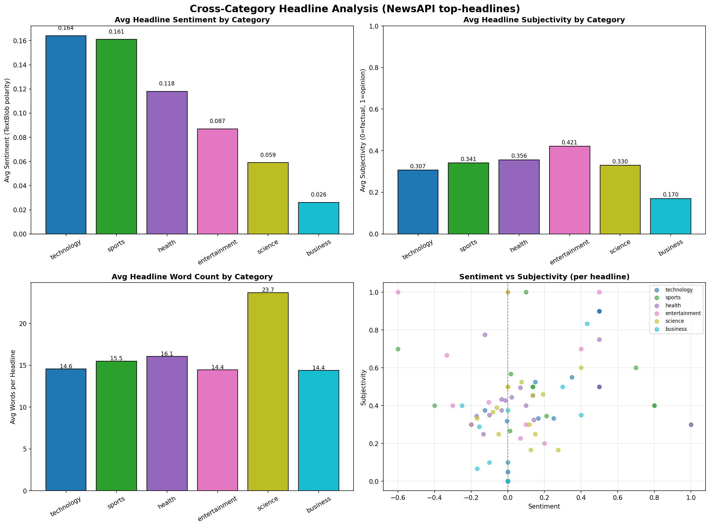

## Overview

This page covers a cross-category headline analysis using NewsAPI's
`/v2/top-headlines` endpoint — the first analysis in this repo to use that
endpoint instead of the job-market `/v2/everything` query every other script
here relies on. It pulls current top headlines across six distinct
categories (business, technology, health, science, entertainment, sports)
and compares sentiment, subjectivity, and headline structure across them.

**Tools used:** TextBlob (sentiment + subjectivity), a live NewsAPI
`/v2/top-headlines` request across six categories.

## Chart

## Category Summary

| Category | Articles | Avg. Sentiment | Avg. Subjectivity | Avg. Word Count | Top Words |
|---|---|---|---|---|---|
| technology | 20 | 0.164 | 0.307 | 14.6 | iphone, leak, latest, windows, nintendo |
| sports | 20 | 0.161 | 0.341 | 15.5 | nation, news, game, live, updates |
| health | 20 | 0.118 | 0.356 | 16.1 | after, most, which, your, health |
| entertainment | 20 | 0.087 | 0.421 | 14.4 | news, into, perfect, stuns, outside |
| science | 19 | 0.059 | 0.330 | 23.7 | space, daily, what, physorg, your |
| business | 18 | 0.026 | 0.170 | 14.4 | news, billion, service, thousands, cnbc |

## Detailed Analysis

Pulled 117 current top headlines across 6 categories via NewsAPI's
`/v2/top-headlines` endpoint. **Sentiment varies sharply by category**, from
**Technology (+0.164)** and **Sports (+0.161)** at the positive end down to
**Business (+0.026)**, which is essentially neutral — business headlines are
written flatly/factually rather than with emotional framing.

**Subjectivity tells a different story**: Business also has the *lowest*
subjectivity (0.170, most fact-based), while **Entertainment is both
moderately positive and the most opinion-laden category (0.421
subjectivity)** — consistent with entertainment coverage leaning into
reactions/hot takes rather than neutral reporting.

**Science headlines stand out structurally**, not emotionally: they average
**23.7 words**, nearly 60% longer than every other category (~14-16 words) —
science journalism apparently needs more words to convey a finding, where
sports/entertainment can rely on punchier, shorter headlines.

The sentiment-vs-subjectivity scatter shows no single category clusters
tightly — even within "Business," headline tone ranges from -0.2 to +1.0 —
meaning category alone is a weak predictor of any individual headline's
tone, even though the *category averages* differ meaningfully.

## Data Files

- [category_comparison_analysis.py](category_comparison_analysis.py) — the analysis script
- [category_comparison_summary.csv](category_comparison_summary.csv) — the per-category summary data
