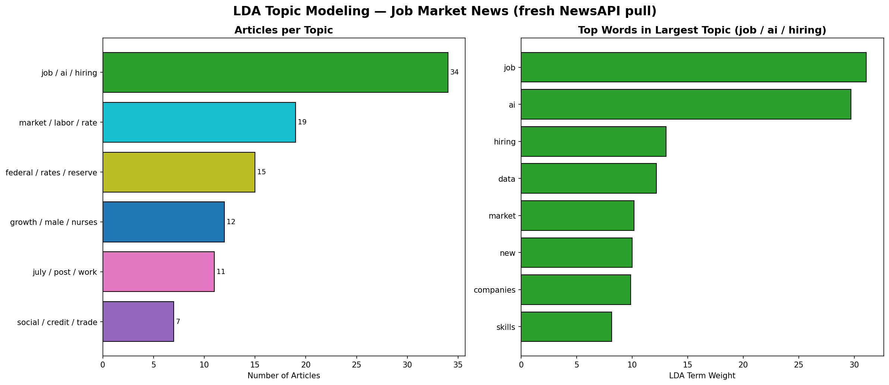
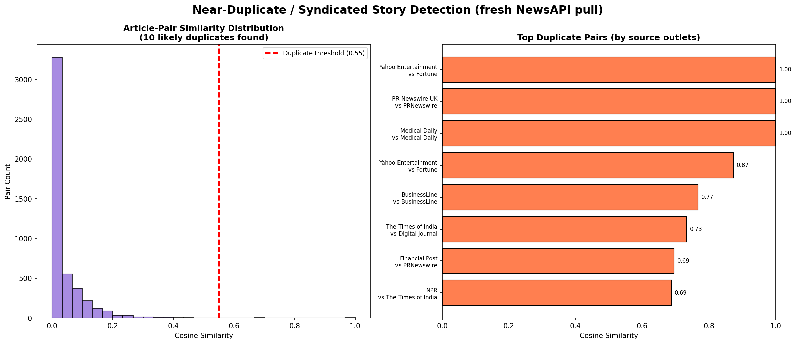

## Overview

This page covers an LDA (Latent Dirichlet Allocation) topic modeling
analysis run on a fresh NewsAPI pull of job-market articles — a
probabilistic topic modeling technique distinct from the hard KMeans
clustering used on the Topic Clustering page.

**Tools used:** scikit-learn (`CountVectorizer`, `LatentDirichletAllocation`),
a live NewsAPI request.

## Chart

## Topic Summary

| Topic | Top Words | Articles | Avg. Confidence |
|---|---|---|---|
| job / ai / hiring | job, ai, hiring, data, market, new, companies, skills | 34 | 0.795 |
| market / labor / rate | market, labor, rate, july, labor market, employment, job, sensex | 19 | 0.855 |
| federal / rates / reserve | federal, rates, reserve, federal reserve, inflation, expected, fed, steady | 15 | 0.804 |
| growth / male / nurses | growth, male, nurses, nursing, south, north, oil, economic | 12 | 0.695 |
| july / post / work | july, post, work, ai, intelligence, artificial intelligence, artificial, private | 11 | 0.799 |
| social / credit / trade | social, credit, trade, company, global, earnings, week, inflation | 7 | 0.757 |

## Analysis

Six topics emerged, and the split is uneven: **"job / ai / hiring" dominates
at 34 articles (35%)** — general AI-and-hiring coverage — nearly double the
next-largest topic. The next tier is **"market / labor / rate" (19)** and
**"federal / rates / reserve" (15)**, which together show that
macroeconomic/Fed policy commentary is a distinct, sizeable chunk of
"job market" coverage, not just noise — something the existing KMeans
clusters (labeled things like "Salary & Growth") don't call out explicitly
as its own theme. The smallest topic, **"social / credit / trade"
(7 articles)**, mixes earnings/inflation language — likely coverage that
only tangentially touches employment.

Within the dominant topic, the top-weighted terms — **job, ai, hiring,
data, market** — confirm that "AI's effect on hiring" is currently the
single biggest storyline in this news sample, ahead of traditional
labor-market or policy framing. Average topic-assignment confidence is
high across the board (0.70–0.86), meaning LDA found genuinely separable
topics rather than a muddy mix.

## Data Files

- [lda_topic_modeling.py](lda_topic_modeling.py) — the analysis script
- [lda_topic_summary.csv](lda_topic_summary.csv) — the raw topic summary data

---

## Part 2: Near-Duplicate / Syndicated Story Detection

### Overview

This section covers a second analysis: TF-IDF + cosine similarity run on
another fresh NewsAPI pull, used to detect articles that are really the same
wire story republished by multiple outlets. This is a different technique
from Part 1's LDA topic modeling, and it's a check none of the other
analyses in this repo perform — everywhere else, each row in the dataset is
treated as an independent article.

**Tools used:** scikit-learn (`TfidfVectorizer`, `cosine_similarity`), a live
NewsAPI request.

### Chart

### Detailed Analysis

Of the 98 fresh articles pulled, **10 pairs (12.2% of all articles)** are
near-duplicates — the same story republished across outlets. Three pairs are
**exact duplicates (similarity = 1.0)**: identical headlines from Yahoo
Entertainment/Fortune, PR Newswire UK/PRNewswire, and even the same outlet
(Medical Daily) publishing itself twice. Beyond exact copies, there's a
cluster of **paraphrased wire coverage around Fed rate decisions** (NPR,
Times of India, Digital Journal all covering the same Fed story at
0.68–0.73 similarity) — meaning what looks like "several sources
independently reporting on the Fed" is really a handful of outlets
rewriting one wire feed.

Bottom line: roughly **1 in 8 "distinct" articles** in this dataset isn't
actually independent reporting, which matters for anyone treating raw
article counts as a proxy for topic importance elsewhere on this site
(e.g., the source-frequency and topic-distribution charts) — those counts
are quietly inflated by syndication, not just organic coverage volume.

### Data Files

- [duplicate_story_detection.py](duplicate_story_detection.py) — the analysis script
- [duplicate_story_summary.csv](duplicate_story_summary.csv) — the full list of detected duplicate pairs
