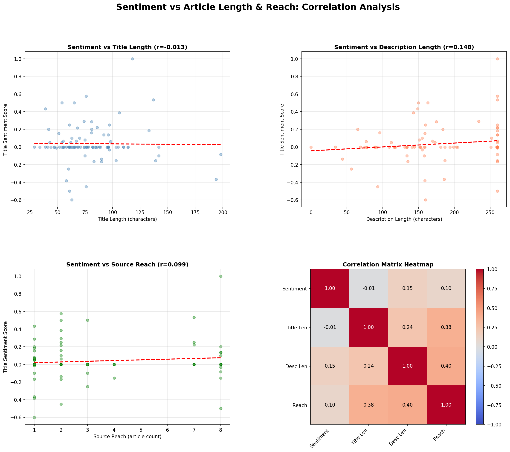
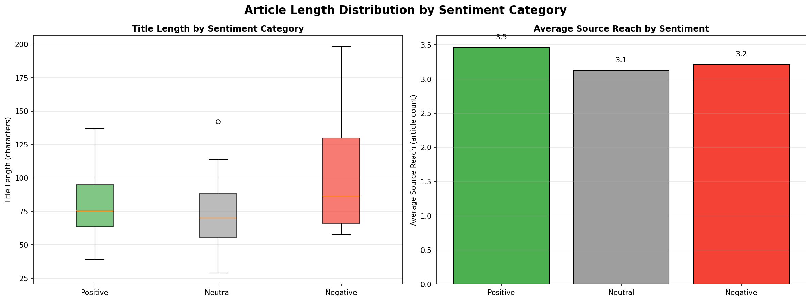

## Overview
This section explores the relationship between article sentiment and key article 
characteristics including title length, description length, and source reach 
(a proxy for publisher popularity). We used Pearson correlation and statistical 
testing to identify meaningful patterns.

---

## Key Findings

- **Title Length vs Source Reach** showed the strongest correlation (r=0.382, p<0.001) 
  meaning larger publications tend to write longer headlines
- **Sentiment vs Description Length** showed a slight positive relationship (r=0.148) 
  suggesting more positive articles tend to have longer descriptions
- **Sentiment vs Title Length** showed virtually no correlation (r=-0.013) 
  meaning headline tone is independent of headline length

---

## Correlation Dashboard

Four charts showing scatter plots with trend lines between sentiment scores, 
article lengths and source reach, plus a full correlation heatmap.

---

## Distribution by Sentiment Category

Box plots comparing title length distributions across Positive, Neutral and Negative 
articles, alongside average source reach per sentiment category.

---

## Data

Two CSV files were generated from this analysis:

- **correlation_analysis_data.csv** — full article dataset with computed features
- **correlation_summary.csv** — summary of all correlation coefficients and p-values