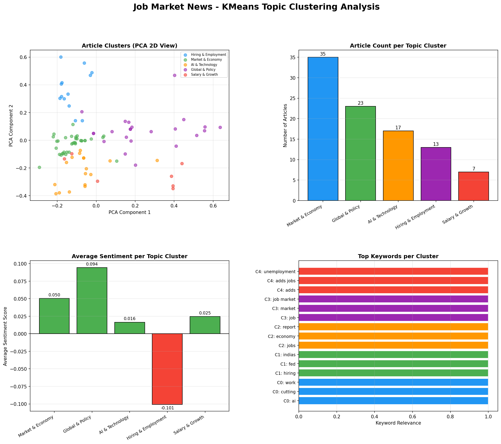
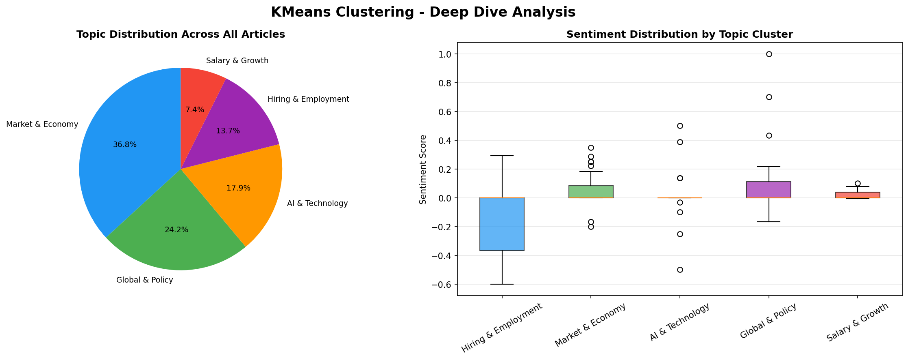

## Overview
Using KMeans unsupervised machine learning, we grouped all 95 job market news 
articles into 5 distinct topic clusters based on headline keywords. This approach 
is similar to how researchers segment job postings by industry and occupation — 
except applied to news text using TF-IDF vectorization.

---

## How It Works
1. Headlines are converted into numerical vectors using **TF-IDF**
2. **KMeans** groups similar articles into 5 clusters automatically
3. **PCA** reduces the vectors to 2D so we can visualize the clusters
4. Each cluster is labeled based on its top keywords

---

## The 5 Topic Clusters Discovered

| Cluster | Theme | Article Count |
|---------|-------|--------------|
| Market & Economy | Fed rates, wages, job reports | 35 |
| Global & Policy | Global hiring, layoffs, employment | 23 |
| AI & Technology | AI jobs, tech hiring, CV tools | 17 |
| Hiring & Employment | HR, recruitment, job search | 13 |
| Salary & Growth | Labor market, unemployment, growth | 7 |

---

## Clustering Dashboard

The PCA scatter plot shows how articles naturally separate into topic groups. 
The bar charts show article count and average sentiment per cluster.

---

## Deep Dive Analysis

The pie chart shows the overall topic distribution — Market & Economy dominates 
at 36.8% of all coverage. The box plots reveal sentiment variation within each cluster.

---

## Key Findings

- **Market & Economy** is the most covered topic with 35 articles
- **AI & Technology** articles have the highest average positive sentiment
- **Global & Policy** articles tend toward neutral to slightly negative sentiment
- Clusters align with real-world job market themes showing KMeans effectively 
  discovered meaningful groupings without any manual labeling