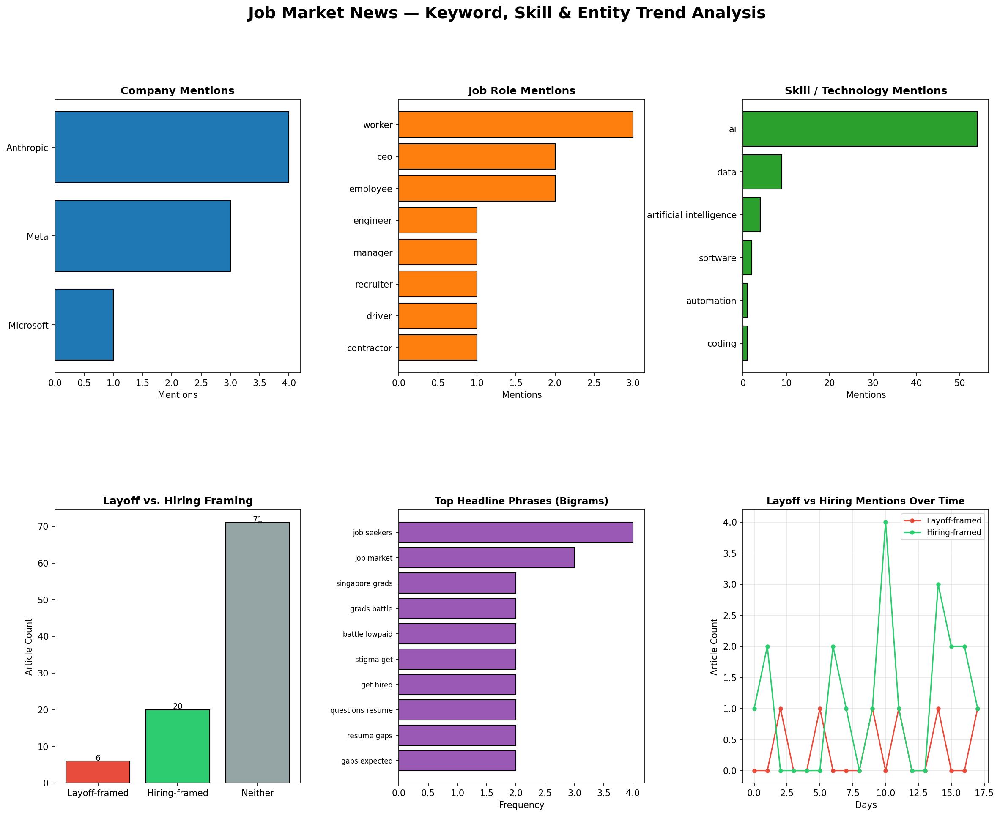

## Overview

This analysis runs entirely on data already collected in this repository
(`job_market_news.csv`) using local, offline tools only — no external API
calls, no keys required. It covers three angles not addressed elsewhere in
this site: named-entity/keyword mining, hiring vs. layoff framing, and
headline phrase (bigram) patterns.

**Tools used:** pandas, matplotlib, regex-based keyword matching — all local.

## Dashboard

The dashboard above covers:

1. **Company mentions** — which companies appear most often in headlines/descriptions
2. **Job role mentions** — which roles are discussed most
3. **Skill/technology mentions** — which skills come up in coverage
4. **Layoff vs. hiring framing** — how many articles lean toward job cuts vs. job growth
5. **Top headline bigrams** — the most common two-word phrases in headlines
6. **Layoff/hiring mentions over time** — trend of framing across the collection period

## Key Findings

- **97 articles** analyzed from the collected dataset
- **20 articles** framed around hiring/growth vs. **6 articles** framed around layoffs — coverage skews toward hiring news in this sample
- Most-mentioned companies: **Anthropic** (4), **Meta** (3), **Microsoft** (1)
- Most-mentioned roles: **worker** (3), **CEO** (2), **employee** (2)

### Top Companies Mentioned

| Company | Mentions |
|---|---|
| Anthropic | 4 |
| Meta | 3 |
| Microsoft | 1 |

### Top Roles Mentioned

| Role | Mentions |
|---|---|
| Worker | 3 |
| CEO | 2 |
| Employee | 2 |
| Engineer | 1 |
| Manager | 1 |
| Recruiter | 1 |
| Driver | 1 |
| Contractor | 1 |

### Top Headline Phrases (Bigrams)

| Phrase | Frequency |
|---|---|
| job seekers | 4 |
| job market | 3 |
| singapore grads | 2 |
| grads battle | 2 |
| battle lowpaid | 2 |
| stigma get | 2 |
| get hired | 2 |
| questions resume | 2 |
| resume gaps | 2 |
| gaps expected | 2 |

## Data Files

- [company_mentions.csv](company_mentions.csv)
- [role_mentions.csv](role_mentions.csv)
- [headline_bigrams.csv](headline_bigrams.csv)
- [layoff_hiring_flags.csv](layoff_hiring_flags.csv)

## Full Article-Level Data (All 97 Articles)

Every article in the dataset, with its layoff/hiring classification:

| Source | Title | Layoff | Hiring | Date |
|---|---|---|---|---|
| Arcamax.com | Older tech workers are tapping out early. Here's what that looks like |  |  | 2026-06-26 |
| New York Post | Popular supermarket guarantees a job interview to anyone who has been out of work for 6 months or more |  |  | 2026-06-26 |
| Freerepublic.com | $7.25 To $25? Senate Democrat’s New Federal Minimum Wage Proposal |  |  | 2026-06-26 |
| The Next Web | California built a tool to catch AI killing jobs | 🔴 Yes |  | 2026-06-26 |
| The New Republic | Transcript: How Colleges Can Defend Themselves From MAGA |  |  | 2026-06-26 |
| Fortune | Singapore grads battle low-paid trainee stigma to get hired |  | 🟢 Yes | 2026-06-26 |
| Fortune | Everyone agrees that you hate AI, but only Mark Cuban sees why Silicon Valley is powerless to fix it |  |  | 2026-06-26 |
| Abcnews.com | Questions about resume gaps are expected. Here's how job seekers can address them |  |  | 2026-06-26 |
| Financial Post | Singapore Grads Battle Low-Paid Traineeships Stigma to Get Hired |  | 🟢 Yes | 2026-06-25 |
| Yahoo Entertainment | Questions about resume gaps are expected. Here's how job seekers can address them |  |  | 2026-06-25 |
| Decrypt | AI Took Your Job? California Wants to Know |  |  | 2026-06-25 |
| CryptoSlate | Bitcoin’s bear market struggle is killing crypto jobs but fueling a $10 billion Wall Street-backed M&A boom |  |  | 2026-06-25 |
| BusinessLine | AI is redrawing the entry gate |  |  | 2026-06-25 |
| The Times of India | High salary in startup or stable MNC job? What is the right choice? Employee gets a reality check six months after job switch |  |  | 2026-06-25 |
| BusinessLine | Sensex today - Stock Market Highlights: Sensex crosses 77,100 as Nifty ends above 24,000 in cautious trade |  |  | 2026-06-25 |
| Crypto Briefing | RAISE US launches $500M AI jobs initiative with bipartisan support |  |  | 2026-06-25 |
| Fortune | Gen Z graduates are blaming AI for their unemployment woes when they should be looking somewhere else |  |  | 2026-06-25 |
| Motorsport.com | Spire and Chris Gabehart countersue Joe Gibbs Racing |  |  | 2026-06-25 |
| Search Engine Journal | Marketing Hiring Down 36% At Big Tech, Data Shows via @sejournal, @MattGSouthern |  | 🟢 Yes | 2026-06-25 |
| Freerepublic.com | Is AI Really Taking All the Jobs? Anthropic Co-Founder Reveals the Data. |  |  | 2026-06-24 |
| New York Post | California’s missing workers: 200K vanish from labor force as job growth flatlines |  | 🟢 Yes | 2026-06-24 |
| The Conversation Africa | Are algorithms unfairly screening out immigrant job applications? |  | 🟢 Yes | 2026-06-24 |
| Crypto Briefing | Santander plans up to 3,000 early retirements in Spain amid AI shift |  |  | 2026-06-24 |
| Insurance Journal | Florida’s Unemployment Rate Is Surging Even as High-Profile Companies Move In |  |  | 2026-06-24 |
| TheStreet | BofA flips the script with bombshell Fed interest-rate outlook |  |  | 2026-06-24 |
| Yahoo Entertainment | Young job seekers might want to swap New York City for the South |  |  | 2026-06-24 |
| Reason | Anthropic Co-Founder: 'The Most Powerful Technology Ever Built' |  |  | 2026-06-23 |
| Bostoninstituteofanalytics.org | Best Digital Marketing Course In Mumbai: 2026 Job Trends |  | 🟢 Yes | 2026-06-23 |
| Mediaite | Shock Report Shows Factory Layoffs At Financial Crisis, Pandemic Levels | 🔴 Yes |  | 2026-06-23 |
| TheStreet | Goldman hints at Fed’s next interest-rate bet under Warsh |  |  | 2026-06-23 |
| Bradenkelley.com | The AI Apprenticeship Economy |  |  | 2026-06-23 |
| GlobeNewswire | Agentic AI in HCM Market to Nearly Triple by 2031 as Labor Scarcity Forces Enterprises Toward Autonomous HR Workflows |  | 🟢 Yes | 2026-06-23 |
| Naftemporiki.gr | AI and skills development emerge as key productivity drivers for Greek businesses |  |  | 2026-06-23 |
| New Zealand Herald | NZ shares trade flat amid global uncertainty, domestic hiring hesitancy – Market close |  | 🟢 Yes | 2026-06-23 |
| The Irish Times | Wins, losses and U-turns: Keir Starmer’s successes and failures in No 10 |  |  | 2026-06-22 |
| Archinect | Four unique projects by Touloukian Touloukian: Your Next Employer? |  |  | 2026-06-22 |
| MarketWatch | ‘I became invisible when I turned 60’: The hidden crisis of late-career unemployment |  |  | 2026-06-22 |
| Starcio.com | 5 Essential Questions for CIOs on Planning IT Careers in the AI Era |  |  | 2026-06-22 |
| Nesbitt.io | Open Source vs the Invisible Hand - Andrew Nesbitt |  |  | 2026-06-21 |
| The Times of India | Rs 6 crore enough to live jobless in India? Man facing office layoff asks internet what is the cost for survival in 'worst-case scenario' | 🔴 Yes |  | 2026-06-20 |
| Placementist.com | "Career coaches" are fear-farming the Stanford AI hiring study [debunk] |  | 🟢 Yes | 2026-06-20 |
| New Zealand Herald | NZ’s economy is beginning to turn around while Australia is showing signs of fatigue - Slade Robertson |  |  | 2026-06-20 |
| Medianewsgroup.com | San Diego added 4,300 jobs in May. Here’s who’s hiring |  | 🟢 Yes | 2026-06-19 |
| Business Insider | One chart shows AI's jobs impact — and how it compares to other tech advances |  |  | 2026-06-19 |
| CNBC | Struggling to find a job? Try looking in Nevada |  | 🟢 Yes | 2026-06-19 |
| The Times of India | World's first trillionaire Elon Musk reveals SpaceX's biggest hiring challenge was convincing married engineers to relocate to Starbase near the Mexican border |  | 🟢 Yes | 2026-06-19 |
| GlobeNewswire | 54% of Aspiring Web3 Professionals Can't Land Their First Job: Bitget Report |  | 🟢 Yes | 2026-06-19 |
| Retail-insight-network.com | UK retail employment falls to record low as labour costs rise |  |  | 2026-06-19 |
| The Atlantic | The Job Market Is Thawing |  | 🟢 Yes | 2026-06-18 |
| Yahoo Entertainment | Exclusive: Arizona senator warns ‘ghost jobs’ are warping labor data, presses Trump admin to investigate |  |  | 2026-06-18 |
| Fortune | Exclusive: Arizona senator warns ‘ghost jobs’ are warping labor data, presses Trump admin to investigate |  |  | 2026-06-18 |
| The Times of India | US weekly jobless claims fall amid low layoffs | 🔴 Yes |  | 2026-06-18 |
| Techtarget.com | HR must have a say in AI policy to forestall legal risks |  |  | 2026-06-18 |
| Financial Post | Posthaste: Canada's in a 'demographic recession.' Should we be worried? |  |  | 2026-06-18 |
| Pstechglobal.com | Digital Marketing Course 2026: Blueprint to Land a Job |  |  | 2026-06-18 |
| DW (English) | Germany news: Industrial employment falls to decade low |  |  | 2026-06-18 |
| BBC News | Number of job vacancies hits five year-low |  |  | 2026-06-18 |
| Ncspin.com | How good is the job market? |  |  | 2026-06-17 |
| Investopedia | Fed Keeps Interest Rates Steady as Warsh Announces Plans to Overhaul Operations |  |  | 2026-06-17 |
| Crypto Briefing | US ADP weekly employment change shows 25,500 job increase, missing forecasts |  | 🟢 Yes | 2026-06-16 |
| The Times of India | Kevin Warsh takes Fed pulpit with immediate challenges, longer-term agenda |  |  | 2026-06-16 |
| Scientific American | U.S. scientists are being lured abroad—and they aren't looking back |  |  | 2026-06-16 |
| Scientific American | Ted Budd |  |  | 2026-06-16 |
| GlobeNewswire | PsyMetrics Milestone Reinforces Position as a Leading White Label Assessment Platform for HR Consultants |  |  | 2026-06-15 |
| Www.gov.uk | LinkedIn and government join forces to help jobseekers build their careers |  |  | 2026-06-15 |
| BusinessLine | Upskilled slum dwellers power India’s retail, healthcare and gig economy |  |  | 2026-06-15 |
| Livemint | Natural intelligence on the ropes: Why India’s middle managers are becoming obsolete |  |  | 2026-06-15 |
| BusinessLine | Global hiring has normalised, but India remains a bright spot: Michael Page CEO |  | 🟢 Yes | 2026-06-15 |
| PRNewswire | ManpowerGroup Returns to VivaTech to Power the Shift from AI Ambition to Workforce Reality |  |  | 2026-06-15 |
| Theregister.com | UK AI hiring surges as firms seek people to babysit the bots |  | 🟢 Yes | 2026-06-15 |
| CNA | Warsh's debut Fed press conference may reveal his strategy for inflation, rates |  |  | 2026-06-15 |
| Business Insider | He finally felt financially stable — until he was laid off. Then came a frustrating job search and restaurant work in NYC. |  |  | 2026-06-15 |
| USA Today | Kevin Warsh's first Fed meeting could bring unwelcome news for Trump |  |  | 2026-06-15 |
| Business Insider | The economy keeps adding jobs. Many job seekers still feel stuck. | 🔴 Yes |  | 2026-06-14 |
| The Times of India | Laid off from her dream tech job, woman says it was the best thing that happened to her. 'My hair stopped falling out' |  |  | 2026-06-12 |
| Dazed | ‘We’ve been left to rot’: Inside Britain’s new ‘Bedroom Generation’ |  |  | 2026-06-12 |
| CBC News | Summer work in short supply for students amid weakened job market |  |  | 2026-06-12 |
| Normaltech.ai | Why AI hasn't replaced software engineers, and won't |  |  | 2026-06-11 |
| Raw Story | Republicans move to gut child labor protections |  |  | 2026-06-10 |
| The Daily Caller | Half Of Americans Now Afraid They’ll Lose Their Jobs To AI |  |  | 2026-06-10 |
| Nakedcapitalism.com | Increasing Employment in Pre-Retirement Years Slows Cognitive Decline |  |  | 2026-06-10 |
| The Conversation Africa | South Africa’s jobs crisis: what 10 years of tax data tells us |  |  | 2026-06-10 |
| The New Republic | Don’t Blame Old People For American Decline |  |  | 2026-06-10 |
| The Root | Expert to Black America: You Can ‘Future-Proof’ Your Job As AI Threatens the Market |  |  | 2026-06-10 |
| Yahoo Entertainment | Analysis-China Inc deploys 'quiet' layoffs as Beijing promotes AI adoption | 🔴 Yes |  | 2026-06-10 |
| Crypto Briefing | Meta launches $115M America’s Workforce Academy to train future technicians with guaranteed jobs |  |  | 2026-06-09 |
| TheStreet | Inflation drives rate-cut debate at Warsh's first Fed meeting |  |  | 2026-06-09 |
| New Zealand Herald | Bay of Plenty records highest unemployment rate in New Zealand, national average dips |  |  | 2026-06-09 |
| PRNewswire | Global Hiring Outlook Holds Steady in Q3 With Mid-Size Employers Showing Most Optimism |  | 🟢 Yes | 2026-06-09 |
| The Times of India | Flexi-staffing industry in India sees 8% YoY growth in new employment in 2025-26: ISF report |  |  | 2026-06-09 |
| Fortune | The man behind Claude Code says you’re comparing AI costs to the wrong thing |  |  | 2026-06-09 |
| Christiantoday.com | A Christian response to the crisis facing young people |  |  | 2026-06-09 |
| BusinessLine | Indian employers turn cautious over hiring in July-Sep amid global uncertainties: Report |  | 🟢 Yes | 2026-06-09 |
| The Irish Times | What sort of workforce are graduates entering, and what do they need to know? |  |  | 2026-06-09 |
| Dailymail.com | Half of graduates earn LESS than the median national wage 5 years after leaving university |  |  | 2026-06-08 |
| pymnts.com | Conference Board Says Easier Hiring Signals Upcoming Labor Market Weakness |  | 🟢 Yes | 2026-06-08 |
| Crypto Briefing | Trump says Fed rate increase would be wrong after jobs report |  |  | 2026-06-08 |

## Interpretation

The bigram list surfaces a recurring narrative thread around **entry-level job
seekers facing resume gap stigma** ("job seekers," "resume gaps," "stigma get
hired") alongside a **regional story about Singapore graduates** in a
low-paid job market. Combined with the hiring/layoff split, the sample
suggests current coverage is leaning toward structural hiring friction
(resume gaps, stigma) rather than mass layoff events — though the small
sample size (97 articles, only 6 layoff-flagged) means this should be read
as directional, not definitive.
